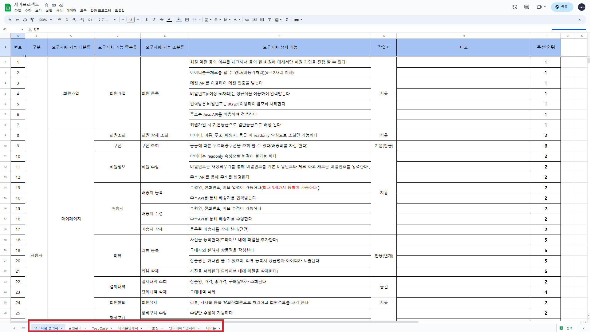

<!-- Improved compatibility of back to top link: See: https://github.com/othneildrew/Best-README-Template/pull/73 -->
<a name="readme-top"></a>
<!--
*** Thanks for checking out the Best-README-Template. If you have a suggestion
*** that would make this better, please fork the repo and create a pull request
*** or simply open an issue with the tag "enhancement".
*** Don't forget to give the project a star!
*** Thanks again! Now go create something AMAZING! :D
-->


<!-- PROJECT SHIELDS -->
<!--
*** I'm using markdown "reference style" links for readability.
*** Reference links are enclosed in brackets [ ] instead of parentheses ( ).
*** See the bottom of this document for the declaration of the reference variables
*** for contributors-url, forks-url, etc. This is an optional, concise syntax you may use.
*** https://www.markdownguide.org/basic-syntax/#reference-style-links
-->

<!-- PROJECT LOGO -->
<br />
<div align="center">
  <a href="https://pf3.chanyongyang.com/" target="_blank">
    
  </a>

  <h3 align="center">푸드得</h3>

  <p align="center">
    Spring Legacy Project를 활용하여 사용자의 상품 구매 시 필요한 전자상거래 구현
    <br>
    <p>작업기간 : 2023.03.24~2023.04.26</p>
    vcs worked on svn
    <br>
  </p>
  <a href="https://pf3.chanyongyang.com/" target="_blank">View Demo</a>
</div>


<!-- TABLE OF CONTENTS -->
<details>
  <summary>Table of Contents</summary>
  <ol>
    <li>
      <a href="#about-the-project">About The Project</a>
      <ul>
        <li><a href="#built-with">Built With</a></li>
      </ul>
    </li>
    <li>
      <a href="#getting-started">Getting Started</a>
      <ul>
        <li><a href="#사전준비">사전준비</a></li>
        <li><a href="#저장소 복제">저장소 복제</a></li>
        <li><a href="#데이터베이스 구성">데이터베이스 구성</a></li>
        <li><a href="#데이터베이스 테이블 생성 쿼리">데이터베이스 테이블 생성 쿼리</a></li>
        <li><a href="#데이터베이스 연결">데이터베이스 연결</a></li>
        <li><a href="#설치">설치</a></li>
        <li><a href="#Web Data Crawling">Web Data Crawling</a></li>
      </ul>
    </li>
    <li>
	<a href="#사용방법 및 기능소개">사용방법 및 기능소개</a>
	  <ul>
   		<li><a href="#기능소개">기능소개</a></li>
		<li><a href="#사용방법">사용방법</a></li>
	  </ul>
    </li>
    <li><a href="#요구사항">요구사항</a></li>
    <li><a href="#Team">Collaborator</a></li>
    <li>
	    <a href="#Etc">Etc..</a>
	    <ul>
		    <li><a href="#작업서류">작업서류</a></li>
		    <li><a href="#PPT">PPT</a></li>
		    <li><a href="#Digital Prototyping">Digital Prototyping</a></li>
		    <li>
              <a href="#프로젝트 후기">프로젝트 후기</a>
              <ul>
                <li><a href="#양찬용">양찬용</a></li>
                <li><a href="#이동건">이동건</a></li>
                <li><a href="#이지윤">이지윤</a></li>
                <li><a href="#박연재">박연재</a></li>
                <li><a href="#이창용">이창용</a></li>
              </ul>
            </li>
	    </ul>
    </li>
    <li><a href="#Contact">Contact</a></li>
    <li>
	    <a href="#Acknowledgments">Acknowledgments</a>
	    <ul>
		    <li><a href="#References">References</a></li>
	    </ul>
    </li>
  </ol>
</details>


<!-- ABOUT THE PROJECT -->
## About The Project


<br>
Spring legacy Project / Maven <br>
학원 세미프로젝트 <br>
Spring, JSP, MariaDB를 활용하여 식자재 쇼핑몰 구현


### Built With
 <br>


<br>
<br>
<br>


<p align="right">(<a href="#readme-top">back to top</a>)</p>


<!-- GETTING STARTED -->
## Getting Started

프로젝트를 복제하여 로컬에서 설정하는 방법에 대한 설명 입니다. <br>

### 사전준비

#### 저장소 복제
   ```sh
   git clone https://github.com/yangchanyong/AWS_fullstack_semi_project.git
   ```

 #### 데이터베이스 구성

  

 #### 데이터베이스 테이블 생성 쿼리
  
  <details>
    <summary>query</summary>  
    
    CREATE TABLE `tbl_member` (
      `id` varchar(500) NOT NULL COMMENT '아이디',
      `pw` varchar(800) DEFAULT NULL COMMENT '비밀번호',
      `name` varchar(500) DEFAULT NULL COMMENT '이름',
      `email` varchar(500) DEFAULT NULL COMMENT '이메일',
      `regDate` datetime DEFAULT current_timestamp() COMMENT '가입일',
      `phone` varchar(500) DEFAULT NULL COMMENT '연락처',
      `grantNo` bigint(20) DEFAULT 1 COMMENT '권한번호(tbl_grant)',
      `gradeNo` bigint(20) DEFAULT 1 COMMENT '등급번호(tbl_grade)',
      PRIMARY KEY (`id`),
      KEY `grantNo` (`grantNo`),
      KEY `gradeNo` (`gradeNo`),
      CONSTRAINT `tbl_member_ibfk_3` FOREIGN KEY (`grantNo`) REFERENCES `tbl_grant` (`grantNo`),
      CONSTRAINT `tbl_member_ibfk_4` FOREIGN KEY (`gradeNo`) REFERENCES `tbl_grade` (`gradeNo`)
    )
    CREATE TABLE `tbl_address` (
      `addrNo` bigint(20) NOT NULL AUTO_INCREMENT COMMENT '배송지번호',
      `addr` varchar(1000) DEFAULT NULL COMMENT '주소',
      `addrDetail` varchar(1000) DEFAULT NULL COMMENT '상세주소',
      `id` varchar(500) DEFAULT NULL COMMENT '아이디(tbl_member)',
      `regDate` datetime DEFAULT current_timestamp() COMMENT '배송지 등록 날짜',
      `addrDefault` char(1) DEFAULT NULL COMMENT '배송지 상태값',
      `addrName` varchar(1000) NOT NULL COMMENT '배송지 이름(별칭)',
      `recipient` varchar(1000) NOT NULL COMMENT '수령인',
      `memo` varchar(1000) DEFAULT NULL COMMENT '배송지 등록시 작성할 메모',
      `phone` varchar(1000) NOT NULL COMMENT '수령인 전화번호',
      PRIMARY KEY (`addrNo`),
      KEY `id` (`id`),
      CONSTRAINT `tbl_address_ibfk_1` FOREIGN KEY (`id`) REFERENCES `tbl_member` (`id`)
    )
    CREATE TABLE `tbl_board` (
      `bno` bigint(20) NOT NULL AUTO_INCREMENT COMMENT '글번호',
      `title` varchar(1000) NOT NULL COMMENT '글제목',
      `content` varchar(3000) NOT NULL COMMENT '글내용',
      `writer` varchar(1000) NOT NULL COMMENT '작성자',
      `regDate` datetime DEFAULT current_timestamp() COMMENT '작성일',
      `updatedate` datetime DEFAULT current_timestamp() COMMENT '수정일',
      `category` bigint(20) DEFAULT NULL COMMENT '카테고리',
      `company` varchar(300) DEFAULT NULL COMMENT '회사명',
      `addr` varchar(1000) DEFAULT NULL COMMENT '주소',
      `email` varchar(1000) DEFAULT NULL COMMENT '이메일',
      `id` varchar(500) DEFAULT NULL COMMENT '아이디(tbl_member)',
      `phone` varchar(500) DEFAULT NULL COMMENT '연락처',
      PRIMARY KEY (`bno`),
      KEY `id` (`id`),
      CONSTRAINT `tbl_board_ibfk_1` FOREIGN KEY (`id`) REFERENCES `tbl_member` (`id`)
    )
    CREATE TABLE `tbl_grade` (
      `gradeNo` bigint(20) NOT NULL AUTO_INCREMENT COMMENT '등급 번호',
      `gradeName` varchar(1000) DEFAULT NULL COMMENT '등급 이름',
      `regDate` datetime DEFAULT current_timestamp() COMMENT '등급 등록 날짜',
      PRIMARY KEY (`gradeNo`)
    )
    CREATE TABLE `tbl_grant` (
      `grantNo` bigint(20) NOT NULL COMMENT '권한부여번호',
      `adminGrant` char(1) DEFAULT NULL COMMENT '권한(1. 관리자, 2. 매니저 3. 일반회원)',
      `regDate` datetime DEFAULT current_timestamp() COMMENT '등록일',
      `updatedate` datetime DEFAULT NULL COMMENT '권한 변경 일자',
      PRIMARY KEY (`grantNo`)
    )
    CREATE TABLE `tbl_productcrawl` (
      `proidx` bigint(20) NOT NULL COMMENT '상품번호',
      `proname` varchar(1000) DEFAULT NULL COMMENT '상품명',
      `proprice` varchar(1000) DEFAULT NULL COMMENT '상품가격',
      `prodetail` varchar(1000) DEFAULT NULL COMMENT '상세사진',
      `thumb` varchar(1000) DEFAULT NULL COMMENT '썸네일사진',
      `codeMain` varchar(1000) DEFAULT NULL COMMENT '상품코드 대분류',
      `codeMiddle` varchar(1000) DEFAULT NULL COMMENT '상품코드 중분류',
      `codeSub` varchar(1000) DEFAULT NULL COMMENT '상품코드 소분류',
      `regdate` datetime DEFAULT current_timestamp() COMMENT '입력일자'
    )
    CREATE TABLE `tbl_procode` (
      `codeNo` bigint(20) NOT NULL COMMENT '상품코드번호',
      `codeMainC` bigint(20) DEFAULT NULL COMMENT '상품코드 대분류',
      `codeMiddleC` bigint(20) DEFAULT NULL COMMENT '상품번호 중분류',
      `codeSubC` bigint(20) DEFAULT NULL COMMENT '상품번호 소분류',
      `codeRegdate` datetime DEFAULT current_timestamp() COMMENT '등록일자',
      PRIMARY KEY (`codeNo`)
    )
    CREATE TABLE `tbl_product` (
      `proNo` bigint(20) NOT NULL AUTO_INCREMENT COMMENT '상품코드',
      `proName` varchar(1000) NOT NULL COMMENT '상품명',
      `proBuyPrice` bigint(20) NOT NULL COMMENT '공급가',
      `proSalePrice` bigint(20) NOT NULL COMMENT '판매가',
      `proCnt` bigint(20) DEFAULT NULL COMMENT '상품수량',
      `proCountry` varchar(1000) DEFAULT NULL COMMENT '원산지',
      `proManf` varchar(1000) DEFAULT NULL COMMENT '제조사',
      `proExp` varchar(1000) DEFAULT NULL COMMENT '유통기한',
      `proRegdate` datetime DEFAULT current_timestamp() COMMENT '등록일자',
      `codeNo` bigint(20) DEFAULT NULL COMMENT '상품코드번호(tbl_procode)',
      PRIMARY KEY (`proNo`),
      KEY `codeNo` (`codeNo`),
      CONSTRAINT `tbl_product_ibfk_1` FOREIGN KEY (`codeNo`) REFERENCES `tbl_procode` (`codeNo`)
    )
    CREATE TABLE `tbl_payment` (
      `payNo` bigint(20) NOT NULL AUTO_INCREMENT COMMENT '결제번호',
      `payCode` bigint(20) NOT NULL COMMENT '승인번호',
      `payMethod` varchar(1000) DEFAULT NULL COMMENT '결제방식',
      `cardCompany` varchar(1000) DEFAULT NULL COMMENT '카드사',
      `cardNumber` varchar(1000) DEFAULT NULL COMMENT '카드번호',
      `payBank` varchar(1000) DEFAULT NULL COMMENT '은행명',
      `installment` varchar(100) DEFAULT NULL,
      `payNumber` varchar(1000) DEFAULT NULL COMMENT '계좌번호',
      `payRegdate` datetime DEFAULT current_timestamp() COMMENT '결제일자',
      `id` varchar(500) DEFAULT NULL COMMENT '아이디(tbl_member)',
      PRIMARY KEY (`payNo`),
      KEY `id` (`id`),
      CONSTRAINT `tbl_payment_ibfk_1` FOREIGN KEY (`id`) REFERENCES `tbl_member` (`id`)
    )
    CREATE TABLE `tbl_coupon` (
      `couNo` bigint(20) NOT NULL AUTO_INCREMENT COMMENT '쿠폰번호',
      `couName` varchar(1000) DEFAULT NULL COMMENT '쿠폰이름',
      `regDate` datetime DEFAULT current_timestamp() COMMENT '등록일',
      `couPrice` bigint(20) DEFAULT 0,
      PRIMARY KEY (`couNo`)
    )
    CREATE TABLE `tbl_coumember` (
      `coumemberNo` bigint(20) NOT NULL AUTO_INCREMENT COMMENT '쿠폰과 멤버의 연결번호',
      `couNo` bigint(20) DEFAULT NULL COMMENT '쿠폰번호(tbl_coupon)',
      `id` varchar(500) DEFAULT NULL COMMENT '아이디(tbl_member)',
      `regDate` datetime DEFAULT current_timestamp() COMMENT '등록일자',
      `couCnt` bigint(20) DEFAULT NULL,
      PRIMARY KEY (`coumemberNo`),
      KEY `couNo` (`couNo`),
      KEY `id` (`id`),
      CONSTRAINT `tbl_coumember_ibfk_1` FOREIGN KEY (`couNo`) REFERENCES `tbl_coupon` (`couNo`),
      CONSTRAINT `tbl_coumember_ibfk_2` FOREIGN KEY (`id`) REFERENCES `tbl_member` (`id`)
    )
    CREATE TABLE `tbl_order` (
      `orderNo` bigint(20) NOT NULL AUTO_INCREMENT,
      `codeNo` varchar(1000) DEFAULT NULL,
      `cartCnt` bigint(20) DEFAULT NULL,
      `proPrice` bigint(20) DEFAULT NULL,
      `id` varchar(500) DEFAULT NULL,
      `coumemberNo` bigint(20) DEFAULT NULL,
      `payNo` bigint(20) DEFAULT NULL,
      `regDate` datetime DEFAULT current_timestamp(),
      `addrNo` bigint(20) DEFAULT NULL,
      PRIMARY KEY (`orderNo`),
      KEY `id` (`id`),
      KEY `coumemberNo` (`coumemberNo`),
      KEY `payNo` (`payNo`),
      KEY `tbl_order_FK` (`addrNo`),
      CONSTRAINT `tbl_order_FK` FOREIGN KEY (`addrNo`) REFERENCES `tbl_address` (`addrNo`),
      CONSTRAINT `tbl_order_ibfk_1` FOREIGN KEY (`id`) REFERENCES `tbl_member` (`id`),
      CONSTRAINT `tbl_order_ibfk_2` FOREIGN KEY (`coumemberNo`) REFERENCES `tbl_coumember` (`coumemberNo`),
      CONSTRAINT `tbl_order_ibfk_3` FOREIGN KEY (`payNo`) REFERENCES `tbl_payment` (`payNo`)
    )
    CREATE TABLE `tbl_review` (
      `rno` bigint(20) NOT NULL AUTO_INCREMENT COMMENT '리뷰 번호',
      `content` varchar(1000) DEFAULT NULL COMMENT '리뷰 내용',
      `writer` varchar(1000) DEFAULT NULL COMMENT '작성자',
      `id` varchar(500) DEFAULT NULL COMMENT '아이디 (tbl_member)',
      `regDate` datetime DEFAULT current_timestamp() COMMENT '리뷰 작성일',
      `codeNo` bigint(20) DEFAULT NULL COMMENT '상품코드번호(tbl_product)',
      PRIMARY KEY (`rno`),
      KEY `codeNo` (`codeNo`),
      KEY `tbl_review_ibfk_1` (`id`),
      CONSTRAINT `codeNo` FOREIGN KEY (`codeNo`) REFERENCES `tbl_procode` (`codeNo`),
      CONSTRAINT `tbl_review_ibfk_1` FOREIGN KEY (`id`) REFERENCES `tbl_member` (`id`)
    )
    CREATE TABLE `tbl_attach` (
      `uuid` varchar(500) NOT NULL COMMENT '고유번호',
      `origin` varchar(500) DEFAULT NULL COMMENT '원본이름',
      `image` char(1) DEFAULT NULL COMMENT '이미지 여부',
      `path` varchar(300) DEFAULT NULL COMMENT '파일 경로',
      `bno` bigint(20) DEFAULT NULL COMMENT '게시판 글번호(tbl_board)',
      `rno` bigint(20) DEFAULT NULL COMMENT '리뷰 번호(tbl_review)',
      PRIMARY KEY (`uuid`),
      KEY `bno` (`bno`),
      KEY `rno` (`rno`),
      CONSTRAINT `tbl_attach_ibfk_1` FOREIGN KEY (`bno`) REFERENCES `tbl_board` (`bno`),
      CONSTRAINT `tbl_attach_ibfk_2` FOREIGN KEY (`rno`) REFERENCES `tbl_review` (`rno`)
    )
    CREATE TABLE `tbl_cart` (
      `cartNo` bigint(20) NOT NULL AUTO_INCREMENT COMMENT '장바구니 번호',
      `cartCnt` varchar(1000) NOT NULL COMMENT '상품수량',
      `id` varchar(500) DEFAULT NULL COMMENT '아이디(tbl_member)',
      `codeNo` bigint(20) DEFAULT NULL COMMENT '상품번호',
      `regDate` datetime DEFAULT current_timestamp() COMMENT '장바구니 등록 일자',
      `proPrice` bigint(20) DEFAULT NULL COMMENT '수량*상품가격',
      PRIMARY KEY (`cartNo`),
      KEY `id` (`id`),
      KEY `tbl_cart_FK` (`codeNo`),
      CONSTRAINT `tbl_cart_FK` FOREIGN KEY (`codeNo`) REFERENCES `tbl_procode` (`codeNo`),
      CONSTRAINT `tbl_cart_ibfk_2` FOREIGN KEY (`id`) REFERENCES `tbl_member` (`id`)
    )
    CREATE TABLE `tbl_statistic` (
      `proNo` bigint(20) NOT NULL,
      `payNo` bigint(20) NOT NULL,
      KEY `proNo` (`proNo`),
      KEY `payNo` (`payNo`),
      CONSTRAINT `tbl_statistic_ibfk_1` FOREIGN KEY (`proNo`) REFERENCES `tbl_product` (`proNo`),
      CONSTRAINT `tbl_statistic_ibfk_2` FOREIGN KEY (`payNo`) REFERENCES `tbl_payment` (`payNo`)
    )
    CREATE TABLE `tbl_secession` (
      `secessionId` varchar(500) NOT NULL COMMENT '탈퇴한 회원의 id (암호화)',
      `regdate` datetime DEFAULT current_timestamp() COMMENT '탈퇴일자',
      PRIMARY KEY (`secessionId`)
    )
    

    


    
    
  </details>
    
    
#### 데이터베이스 연결 <br>
root/src/main/resources/jdbc.properties 생성
<br>

  ```sh
db.classname=net.sf.log4jdbc.sql.jdbcapi.DriverSpy
db.url=jdbc:log4jdbc:mariadb://'DB url':'port'/'DB name'
db.username='username'
db.password='password'
  ```

입력

### 설치

1. JDK 1.8
2. STS 3.9.4
3. MariaDB
4. Lombok
5. Tomcat9

### Web Data Crawling
<pre>
이슈 :

- 이미지 크롤링은 저작권의 문제로 본 코드에서는 Tests에 있는 주소를 직접 입력하여 이미지 크롤링 하여야 합니다.경로는 (C:\\semiimg) 입니다
</pre>


<p align="right">(<a href="#readme-top">back to top</a>)</p>


<!-- USAGE EXAMPLES -->
## 사용방법 및 기능소개
#### 기능소개
<pre>
1. 회원 :
    1-1. 회원가입 : id, pw, 이름, 주소, email를 입력하여 회원가입
    1-2. 로그인 : id, pw를 입력, DB에 저장된 값을 확인하여 로그인 성공/실패
    1-3. 정보 수정 : 로그인한 유저의 세션을 가져와 기본 정보 및 PW 변경
    1-4. 배송지 등록 : 배송지를 입력하여 DB에 저장
    1-5. 쿠폰 정보 조회 : 회원가입 시 무료배송 쿠폰 5장 발급, 회원 등급 달성 시  추가 발급

2. 상품 :
     2-1. 상품 조회 : DB에 저장된 상품을 카테고리별, 검색(제품명), 신상품(등록순)
     2-2. 장바구니 : 선택한 상품을 장바구니에 저장한다.
     2-3. 상품 구매 : 장바구니에 저장된 상품을 선택하여 구매 혹은 상품 상세페이지에 있는 단품 구매
     2-4. 결제 : import를 사용하여 카드 결제 기능 구현 (최종 결제 금액과 상관없이 100원 결제 / 익일 04:00시 환불)
     2-5. 구매내역 : 구매한 상품에 한하여 구매내역 출력 및 삭제 기능


3. 리뷰 :
     3-1. 리뷰 작성 : 구매한 상품에 한하여 리뷰 작성, 수정, 삭제


4. 게시판 :
    4-1. 대량 문의 게시판 : 등록된 상품 혹은 그 외 상품의 대량 문의, 작성한 본인에 한하여 게시글 확인 가능하며 관리자는 모든 회원의 글을 확인할 수 있음.
    4-2. 공지사항 게시판 : 관리자가 작성한 공지사항(통관 이슈, 이벤트 등)을 조회만 가능, 관리자는 등록, 수정, 삭제 가능


5. 관리자 :
    5-1. 등급 : 회원별 등급 수정 가능 (브론즈, 골드, 실버)
    5-2. 쿠폰 발행 : 배송비 무료 쿠폰 등 결제금액을 차감할 수 있는 쿠폰 발행
    5-3. 주문내역 : 회원이 상품을 주문하면 주문내역을 확인하고 발송 상태 변경

6. Web Data Crawling
   - 지키미몰에 있는 카테고리 별 상품 썸네일, 상세정보, 상세이미지를 크롤링 하여 사용
</pre>

#### 사용방법
<pre>
※ 일반회원

1. 회원가입
2. 로그인 (demo 페이지 기준 ycy/1234 입력)
3. 우측상단 메뉴탭에서 배송지 등록
4. 상품 장바구니 추가 / 상품 바로구매
	4-1.  장바구니에서 구매할 상품 선택 및 주문
5. 주문 (결제시 100원 고정, 익일 04:00 환불)
6. 게시판
 	6-1. 공지사항 게시판에서 각종 이슈 확인
	6-2. 대량문의 게시판에서 등록된 상품 혹은 그외 상품 문의

※ 관리자

1. 로그인 (demo 페이지 기준 ycy/1234 입력)
2. 우측상단 메뉴탭에서 관리자 페이지 이동
3. 회원 등급 조정
4. 회원 권한 조정
5. 쿠폰 등록
</pre>


<p align="right">(<a href="#readme-top">back to top</a>)</p>


<!-- ROADMAP -->
## 요구사항

### 작업목록
- [x] 작업완료 
- [ ] 작업예정 

#### 일반 회원
- [x] 회원가입 
  - [x] 메일 API를 이용하여 메일인증 
  - [x] 주소 API를 이용하여 주소검색 및 입력 
- [x] 로그인
- [x] 회원상세조회
- [x] 쿠폰조회
- [x] 회원수정
  - [ ] 주소 API를 이용하여 주소 검색 및 수정
- [x] 배송지 등록, 수정, 삭제
- [x] 리뷰 등록, 삭제
- [x] 결제내역 조회, 삭제
- [x] 회원탈퇴
  - [x] 리뷰, 게시글을 '탈퇴회원'으로 처리하고 회원정보 파기
- [x] 장바구니 수정, 삭제
- [x] 주문
- [x] 게시판
  - [x] 공지사항 게시판 조회
  - [x] 대량문의 게시판 작성, 조회
- [x] 상품
  - [x] 품목별조회
  - [x] 신상품조회
  - [x] 장바구니 추가
  
<br>

#### 매니저
- [x] 공지사항 게시판 등록, 수정, 삭제
- [x] 대량문의 게시판 조회, 삭제
- [x] 상품
  - [x] 상품 조회
  - [ ] 상품 등록
  - [ ] 상품 수정
  - [ ] 상품 삭제
- [ ] 통계
  - [ ] 원가, 매출액, 영업이익 등 선형 차트형태로 조회
- [x] 주문 목록
- [x] 주문 상세
- [x] 주문 발송 상태
- [x] 회원등급
  - [x] 회원등급 등록
  - [x] 회원등급 삭제
- [ ] 쿠폰
  - [ ] 쿠폰 등록, 수정, 삭제
- [x] 회원 목록
  - [x] 회원 조회
  - [ ] 회원 삭제

<br>

#### 관리자
- [x] 권한
  - [x] 권한 조회
  - [x] 권한 부여
  - [x] 권한 수정

<p align="right">(<a href="#readme-top">back to top</a>)</p>

## Collaborator
 Team Project 
 <pre>
공통 : DB설계, 디지털 프로토 타이핑, 서류작성 (요구사항 정의서, 테이블 명세서, TEST CASE, 인터페이스 명세서 / Etc.document 참고)

양찬용(본인) : <b>조장</b>, 게시판, 상품, 회원기능 일부(수정, 탈퇴) <a href="https://github.com/yangchanyong" target="_blank">GitHub Link</a>

이동건 : 데이터 크롤링(<a href="https://xn--352blxn61avvg.com/">지키미 몰</a>), 장바구니, 결제 <a href="https://github.com/DGeon" target="_blank">GitHub Link</a>

박연재 : 리뷰, 상품, 관리자 <a href="https://github.com/yeonjae97" target="_blank">GitHub Link</a>

이지윤 : 회원 <a href="https://github.com/jooneei17" target="_blank">GitHub Link</a>

이창용 : 서류정리, 회의록작성 <a href="https://github.com/starping1" target="_blank">GitHub Link</a>

</pre>

<p align="right">(<a href="#readme-top">back to top</a>)</p>


<!-- LICENSE -->
## Etc
#### 작업 서류
<a href="https://docs.google.com/spreadsheets/d/1vR_ndYQ9Qo1sNOTPU-IdHNJidZm6kdvIH_R9J21spFo/edit?usp=sharing">
  요구사항 정의서, 일정관리, test case, 테이블 명세서, 인터페이스 명세서 등
</a>
 <br>
위 링크 이동시 하단 sheet를 클릭하여 서류 이동할 수 있음

<br>

#### PPT

<a href="https://www.canva.com/design/DAFgzktHeAY/UTyodLZXtAGB1K2k8WMEqw/view?utm_content=DAFgzktHeAY&utm_campaign=share_your_design&utm_medium=link&utm_source=shareyourdesignpanel">PPT Link</a>

<details>
<summary>PPT Images</summary>


</details>

<br>

#### Digital Prototyping
<a href="https://ovenapp.io/view/9aaHlLOD5IvM5pwGJGYgNHA5T7OIKK3J/RZBG9">Digital Prototyping Link<a/>

### 프로젝트 후기
#### 양찬용
<pre>
저는 회의와 서류에 중점을 두고 프로젝트를 진행했습니다. 
팀원 한 명 한 명이 도태되는 일 없이 프로젝트를 진행하기 위해 
매일 오전에 회의하여 진행도, 서류작업 등 보고를 받았고, 
학원이 끝나는 시간엔 일일업무보고를 디스코드에 올려 서로 업무가 얼마나 
진행되었는지 보고를 받았고, 저 또한 팀원들에게 보고를 했습니다. 
그 결과 서로 막힌 부분이 있거나 시간 관계상 빨리 끝내야 하는 일이 생길 때
던 일을 멈추고 팀원을 도와줘야 되는 경우에도 서로 막힘없이 프로젝트를 진행했고, 
즐겁게 프로젝트를 끝낼 수 있었습니다. 


위 프로젝트를 진행하며 아쉬웠던 점은 시간 관계상 구현하지 못한 
일부 관리자 기능(통계,   실시간 상담, 상품 등록 및 수정 등)입니다. 
프로젝트 설계 단계에서는 많은 관리자 기능이 있었고, 
첫 번째 프로젝트에서 맡았던 일을 똑같이 다시 맡으면 
관리자 기능을 많이 작업할 수 있었지만, 팀원 모두 실력 향상을 위해 
모두 첫 프로젝트와 다른 작업을 하길 원했고 저 또한 그렇게 하길 원했습니다. 
비록 일부 기능을 구현하지 못해서 아쉬웠지만 
다들 큰 폭으로 실력 향상이 되어서 만족스러운 프로젝트였습니다.
</pre>

#### 이동건
<pre>
Spring이 무엇인지도 모르고 프로젝트를 시작했지만 
Controller와 Service, DTO, Mapper등을 사용해보면서 왜 써야하는지, 
왜 필요한지를 알게 되었고, 비동기 처리 또한 많은 부분에서 필요한 것들이 많았으며, 
팀원들과 협동을 통해 프로젝트에 재미를 더 붙일 수 있어서 좋은 시간이었습니다. 
</pre>
#### 이지윤
<pre>
서류 작업부터 여러 가지 툴을 사용하는 프로젝트는 처음이라 
그 과정에서 겪은 어려운 점도 많았지만 프로젝트 덕분에 
스프링과 DB등의 툴 사용이 전보다 익숙해질 수 있었습니다.
</pre>
#### 박연재
<pre>
팀원들과 협력과 강사님의 피드백으로 기능, 
화면 면에서 배울 점들이 많았고, 
코드를 작성하면서 서류도 동시에 작업해야한다는 것과 
그와 동시에 서로 간의 피드백과 의사소통이 엄청 중요하다라는 것을 
프로젝트를 통해 실감하게 되었습니다.
</pre>
#### 이창용
<pre>
ppt 템플릿 조사, 부트스트랩 템플릿 조사, 일일 회의록 주간 회의록 작성 등등 
맡은 업무에 대해 열심히 실천하였고 마음 한편으론 아쉬움이 남았다
</pre>


<p align="right">(<a href="#readme-top">back to top</a>)</p>


<!-- CONTACT -->
## Contact

Yang Chanyong - cksdyd93@gmail.com

<a href="https://pf3.chanyongyang.com" target="_blank">Demo Link</a>

<a href="https://www.chanyongyang.com" target="_blank">Portfolio Link</a>

<p align="right">(<a href="#readme-top">back to top</a>)</p>


<!-- ACKNOWLEDGMENTS -->
## Acknowledgments

이 프로젝트를 사용해주시고 README를 읽어주신 여러분께 대단히 감사합니다!

### References
README Template : [README-Template](https://github.com/othneildrew/Best-README-Template)<br>
Data Crawling : [지키미몰](https://xn--352blxn61avvg.com/)<br>
Reference : [식자재왕](https://www.ewangmart.com/main/index.do?utm_source=google&utm_medium=sa&utm_campaign=sa_google_pc&utm_content=%EB%A9%94%EC%9D%B8_%EB%B8%8C%EB%9E%9C%EB%93%9C&utm_term=%EC%8B%9D%EC%9E%90%EC%9E%AC%EC%99%95&gad=1&gclid=Cj0KCQjwnf-kBhCnARIsAFlg490cNtHom16NNcR-4PXQOPzO6mPCudFADp0KuDsg63amSdgAijsBm5QaAsh6EALw_wcB)<br>
Reference : [씨엔푸드몰](https://seanfoodmall.com/)<br>


<p align="right">(<a href="#readme-top">back to top</a>)</p>

[](https://hits.seeyoufarm.com)

